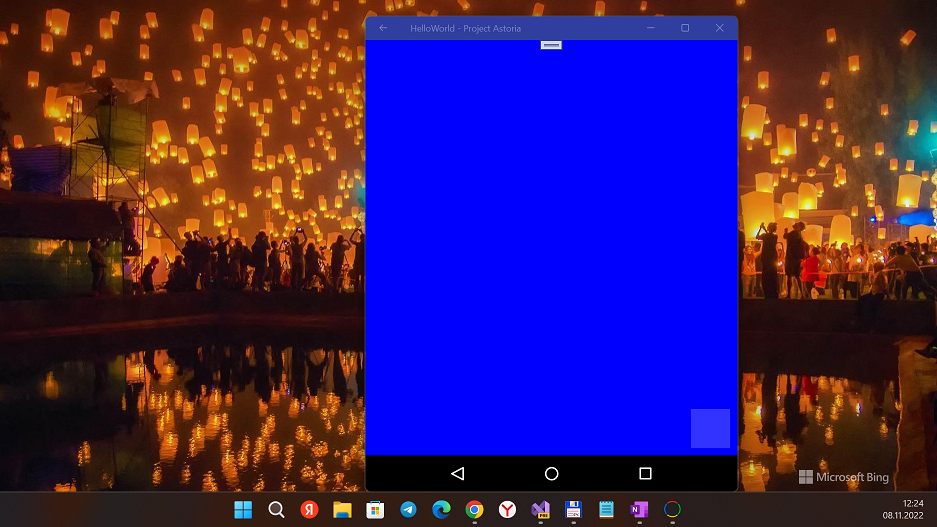
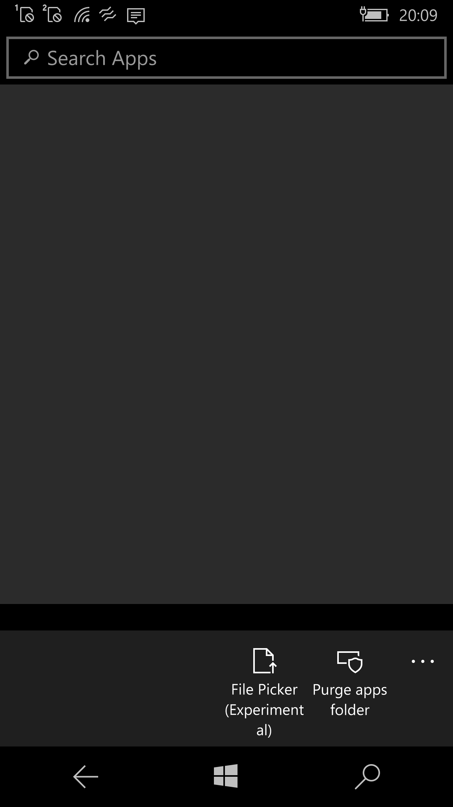
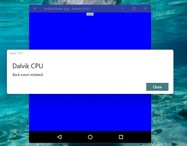

# AstoriaUWP 0.0.0.(8)

This is my fork based on Carl's [AstoriaUWP](https://github.com/cbialorucki/AstoriaUWP) solution. Note that if only _clone_ of original AstoriaUWP project. I am not pro in deep C# coding, so this solution iz _frozen_... But today/at now (in 2025) , I tried to do little Astoria "flashback"... :)

## Abstract
"Project Astoria" remake (UWP). A Dex.Net libraryMono/.NET library used to parse Android DEX files. Its main purpose is to support utilities for disassembling and presenting the contents of DEX files.

Dex.net can display the output of a DEX file in multiple ways. It currently supports 2 languages (or writers in the source):

1. Plain Dex

This format follows the syntax in the Dalvik bytecode. The only exceptions are the switch and fill-array opcodes which use data tables. The data tables are parsed and displayed as part of the opcode.

2. Dex

This format provides a direct translation of the 'plain dex' opcodes into a more readable format. It also resolves references to strings, methods, classes, fields. It maintains a 1-1 mapping with standard opcodes.

An example of how this language would format an opcode: 'aput v0, v1, v2' is displayed as 'v1[v2] = v0'.

## Screenshots

  
  
  

## My actions (my 2 cents) 
- Some WIKI data added. 
- Quick R.E. (only some try...catch added to avoid accident app halts... and nothing more)
- DEX 7 detected (see Images/uc83.apk sample that can't de-dexed).

## Description
"Astoria for Universal Windows Platform" (AstoriaUWP) is an APK interpreter for the Universal Windows Platform. 
This program attempts to interpret an Android .APK file and runs it inside a UWP wrapper.

Important Note: This project was created as a proof-of-concept over a short amount of time. The code may not be perfect. 100500 bugs/uncompleted deals still there.
It exists for demonstration and educational purposes. Feel free to fork this project... and to do your own "engeneer journey"!

## Coding "workbench"
- Visual Studio 2022 (But VS 2017 compatibility remained, for Live WinPhone debugging, heh!)
- Windows SDK 19041 + 15063 installed (for W10M compatibility).
- x64 and ARM targets used

## What's new?

### DEX 7 Detection and Parsing Support Added
I've implemented support for DEX 7 format detection and parsing in your AstoriaUWP Android simulator project. Here's changes what I've done:

1. Updated DexHeader.cs

- Added support for DEX version 7 (037) and other versions
- Added logging to display the detected DEX version
- Modified the header parsing to be more flexible with different DEX versions

2. Updated DexParser.cs

- Fixed the version parsing to correctly extract the version number from the magic string
- Added support for DEX versions 035, 037 (DEX 7), 038, 039, etc.
- Added documentation about which Android versions use which DEX versions:
  - Version 035 is used in Android 5.0+
  - Version 037 is used in Android 7.0+
  - Version 038 is used in Android 8.0+
  - Version 039 is used in Android 9.0+
- Added logging to display the detected DEX version

### How It Works
The DEX file format starts with a magic string "dex\n" followed by a version number (e.g., "037\0" for DEX 7). The code now correctly parses this version number and allows processing of DEX 7 files without throwing version-related exceptions.

The changes maintain backward compatibility with older DEX versions while adding support for newer ones, including DEX 7 and beyond.

## Testing
You can test this implementation with DEX 7 files from Android 7.0+ applications. The code will now detect and log the DEX version during parsing, which should help with debugging.

Enjoy your Android simulator for old Nokia phones with Windows 10 Mobile OS!

## Test scenario
- Place Images/helloworld1.apk at Pictures folder at your PC/WinPhone

- Run AstoriaUWP, and click "Pick folder&file (experimental)". Then find and choose helloworld1.apk and try to open this apk file.
- After loading phase, click "Install app" button.
- After installing phase, click "Apps list" button.
- Go to App Storage, find Layout folder.
- Try to run Emulator by tapping on "Hello world" item at apps list

In result, the phrase "Layout not found" must be appeared on Emu screen... or, maybe, "testbox" on right bottom corner :)

## Project status
- Intro/RnD +- 13/100
- Design +- 3/100 
- Tech. project +- 21/100
- Dev. project  +- 3/100
- Tests/Intro   +- 4/100

## Explore more resources for your own dev journey

AstoriaUWP also used some code from the following projects:
- https://source.android.com/                 Android Open Source Project
- https://github.com/tbaron/androidxmldotnet  Android Xml .net
- https://github.com/mariokmk/dex.net         DEX.net

## Contribute!
There's still a TON of things missing from this proof-of-concept (MVP) and areas of improvement. Help wanted. 
Feel free to PR your improvements for this experimental soft!

## References
- https://github.com/cbialorucki/AstoriaUWP Original AstoriaUWP project 
- https://github.com/cbialorucki Carl J. Bialorucki, C# developer, author/creator of AstoriaUWP

## .. 

- AstoriaUWP is RnD project only. AS-IS. No support. Distributed under the MIT License.

## .
- [M][E] 2022--2025

