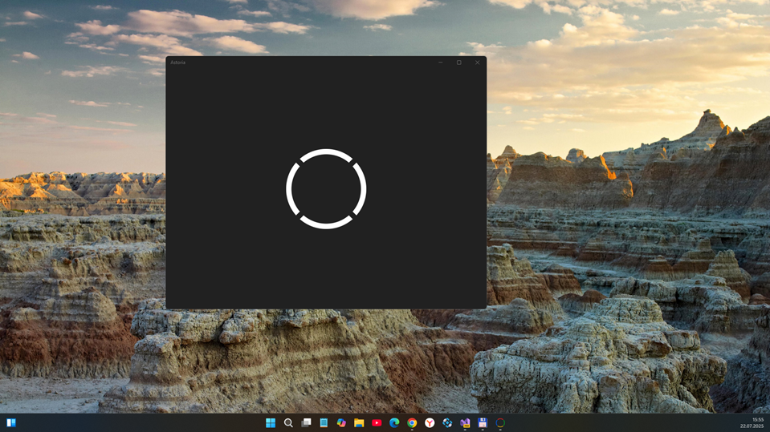

# AstoriaUWP 0.1.0-alpha -- pure branch

This is my "pure fork" of Carl's Astoria project (almost zero "UI-cosmetics", minimal functional changes for DalvikCPU..) . 

## Words of author 

"
- Astoria for Universal Windows Platform
An APK interpreter for the Universal Windows Platform. This program attempts to interpret an Android .APK file and runs it inside a UWP wrapper.

As of August 9th, 2017 this project has not been actively maintained. Forks are still encouraged!

Note: This project was created as a proof-of-concept over a short amount of time. The code may not be perfect. It exists for demonstration and educational purposes. Feel free to fork this project!

This project uses code from the following projects:

<a href="https://source.android.com/">Android Open Source Project</a>

<a href="https://github.com/tbaron/androidxmldotnet">androidxmldotnet</a>

<a href="https://github.com/mariokmk/dex.net">dex.net</a>

"
- Carl J. Bialorucki (approx. 2017-2018 year)

## Screenshot(s)

## Status

Frozen. For PC-historic purposes.

## References

- https://github.com/cbialorucki/AstoriaUWP Original AstoriaUWP project 
- https://github.com/cbialorucki Carl J. Bialorucki, C# developer, author/creator of AstoriaUWP
- https://forums.windowscentral.com/threads/poc-astoria-a-wine-style-android-compatibility-layer-program-for-universal-windows-platform.453870/ [POC] Astoria - A WINE-style Android Compatibility Layer Program for Universal Windows Platform (Windows Central Forum, Ticomfreak, Mar 9, 2017)

## .. 

- AstoriaUWP is RnD project only. AS-IS. No support. Distributed under the MIT License.

## .

- [M][E] Jul, 22 2025

